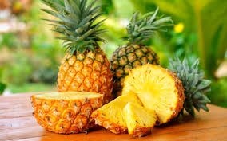

<html lang="es">
<head>
    <meta charset="UTF-8">
    <meta name="viewport" content="width=device-width, initial-scale=1.0">
    <title> El platano sonriente </title>
    
</head>
<body>

<header>
   Frutas
</header>

<nav> <a href="https://marcusfilidor.github.io/fruteria/" class="back-to-home">Volver al Inicio</a> </nav>

    

        <h3>Manzana</h3>
        
        
 $48.90 por kg 

    

    

        <h3>Plátano</h3>
        
        
 $20.23 por kg 

    

    

        <h3>Naranja</h3>
        
        
 $52.00 por kg 

    

    

        <h3>Uvas</h3>
        
        
 $99.00 por kg 

    

    

        <h3>Pera</h3>
        
        
 $62.00 por kg 

    

     

        <h3>Fresas</h3>
        
        
 $67.70 por kg 

    

     

        <h3>Ciruela</h3>
        
        
 $82.20 por kg 

    

     

        <h3>Durazno</h3>
        
        
 $60.00 por kg 

    

     

        <h3>Granada</h3>
        
        
 $88.00 por kg 

    

     

        <h3>Limon</h3>
        
        
 $40.00 por kg 

    

  
     

        <h3>Mango</h3>
        
        
 $90.00 por kg 

    

     

        <h3>Melon</h3>
        
        
 $33.80 por kg 

    

     

        <h3>Piña</h3>
        
        
 $27.30 por kg 

    

     

        <h3>Sandia</h3>
        
        
 $25.90 por kg 

    

<footer>
    <h2>Frutería "El Plátano Riendo"</h2>
    
&copy; 2024 Todos los derechos reservados

</footer>

</body>
</html>
